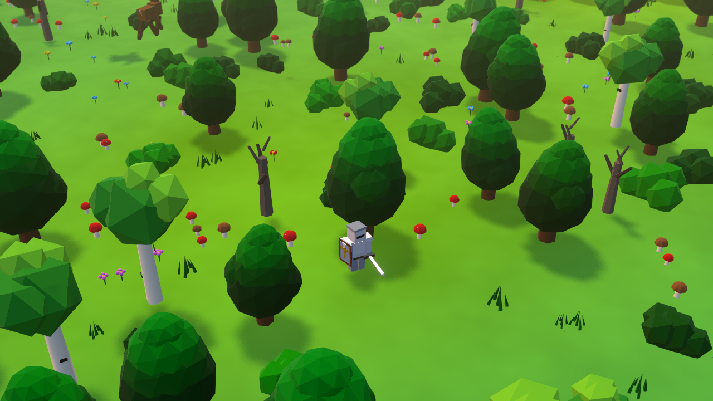
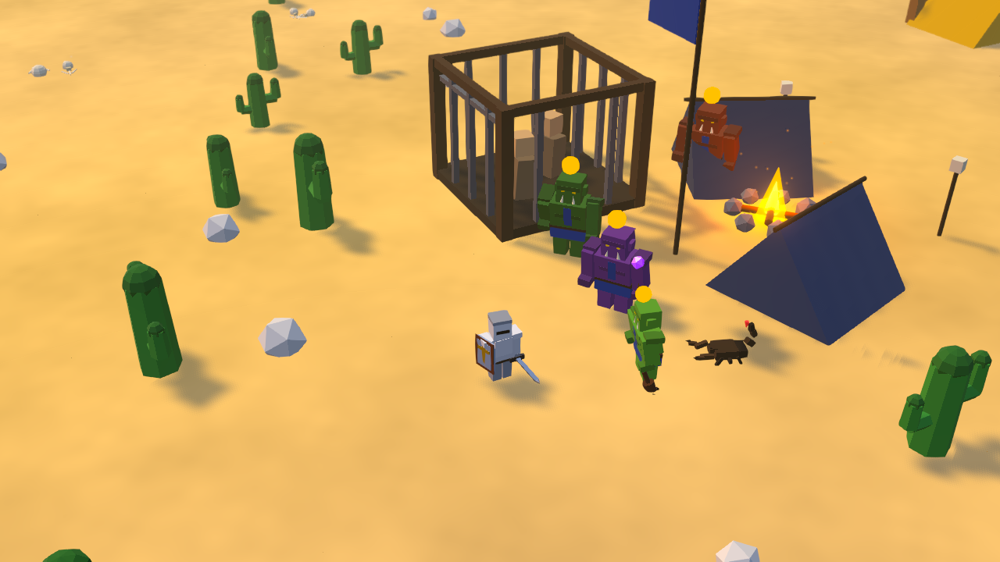
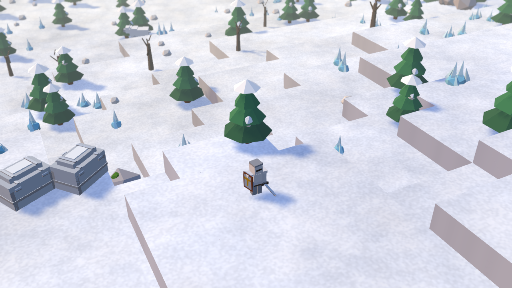
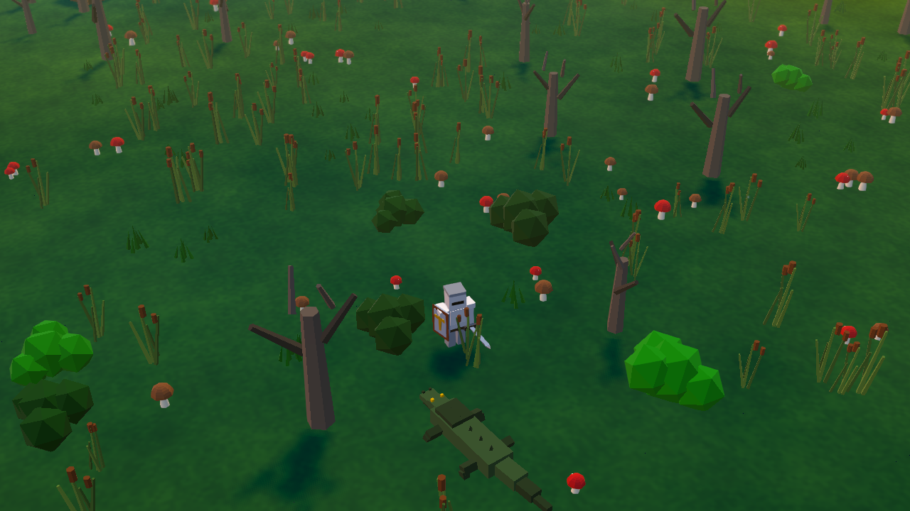
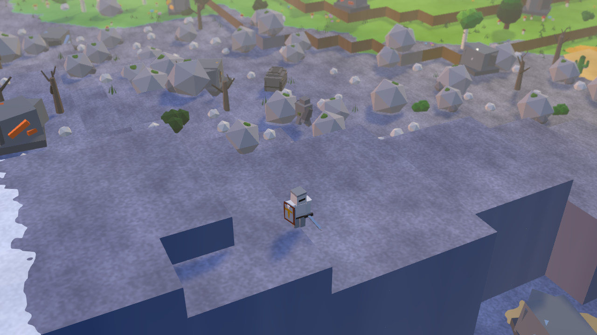
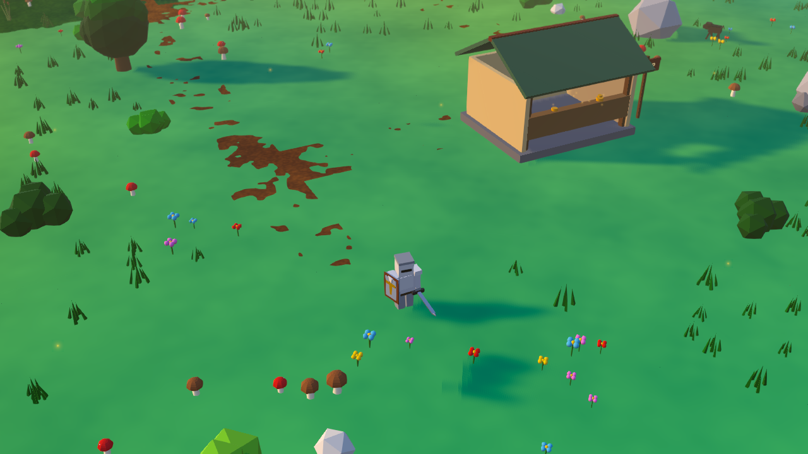

# tileworld

A single-player 3D action-RPG that runs entirely in the browser — explore a procedurally generated island, drive back the orks, and grow your castle. No backend, no install beyond `npm`.



Built with **React 19 + react-three-fiber + three.js + TypeScript + Vite**. The map, scattered props, mobs, and most sound effects are generated deterministically at runtime. Days are a free-roam prep window — mine, forage, hunt, and rescue across the biomes — then ring the war bell and hold the castle through the night.

## Run it

```bash
npm install
npm run dev      # dev server with hot reload → open the printed localhost URL
```

Prefer a desktop build? Grab the Windows installer (`.msi` / `.exe`) from the [latest release](https://github.com/miskibin/tileworld/releases/latest).

## Biomes

One island, six distinct regions — each answers a different need for the night ahead.

<table>
  <tr>
    <td width="50%"><br><b>Forest</b> — dense low woods to the west; shake the trees for apples.</td>
    <td width="50%"><br><b>Desert</b> — northeastern dunes dotted with ork camps; clear the guards to free captives who join your muster.</td>
  </tr>
  <tr>
    <td width="50%"><br><b>Snowfields</b> — the frozen north under a low white massif, scattered with pines and chests.</td>
    <td width="50%"><br><b>Swamp</b> — a murky southern marsh; forage marsh herbs, but mind the slow and the poison.</td>
  </tr>
  <tr>
    <td width="50%"><br><b>Rock highlands</b> — jagged eastern cliffs; mine ore boulders for the stone your walls and towers cost.</td>
    <td width="50%"><br><b>Grass heartland</b> — the open green centre where your keep stands and the muster ground forms.</td>
  </tr>
</table>

## Controls

| Action | Input |
|--------|-------|
| Move | WASD / arrow keys |
| Sprint | Shift |
| Jump | Space |
| Look | Mouse |
| Attack | Left-click |
| Block | Right-click |
| Interact (bell, chests, signposts) | E |
| Eat | Q |
| Buffs (resist / power / haste) | Z / X / C |
| Bag | I |
| Pause | Esc |

## Scripts

```bash
npm run dev      # Vite dev server (HMR)
npm run build    # typecheck (tsc -b) + production bundle — the correctness gate
npm run lint     # eslint
npm test         # vitest — pure-logic unit tests (pathfinding, waves, stores)
npm run preview  # serve the production build
npm run shot     # headless screenshot of the running dev server (Playwright + SwiftShader)
```

`npm run build` is the correctness gate (it typechecks before bundling); `npm test` covers the deterministic logic. Anything visual is verified by running the game.

## Architecture

See [CLAUDE.md](CLAUDE.md) for a full map of the codebase — the hand-rolled store pattern, the grid coordinate system, the navigation/pathfinding stack, the per-frame game loop, the HUD, and the procedural audio.
